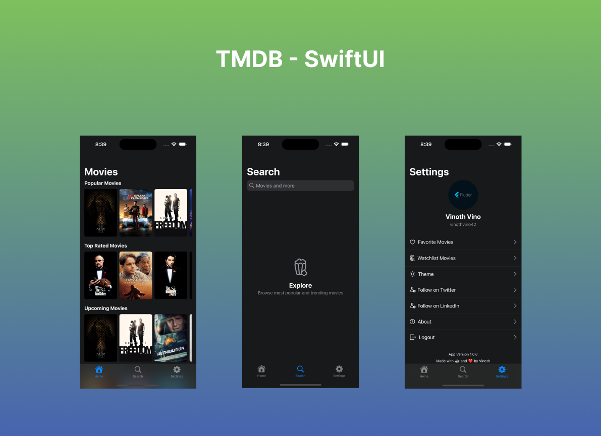

# TMDB

A Movie app written using SwiftUI and TMDB API to demonstrate the MVVM + Repository Pattern, Dependency Injection using Factory and Unit & UI Testing

## Screenshot


## How to run
### Requirement
1. Xcode 15
2. macOS Ventura 13.5

### Getting started
- Clone the repository
- Paste the TMDB API Key inside the APIClient.swift (api_key query item)
- Build and run the project

### Features & Libraries
1. Login
2. Movie List (Popular, Trending, Thriller, etc)
3. Favorite and Watchlist Movies
4. Clean Network Layer
5. ```ContentUnavailableView``` for Empty State
6. ```NukeUI``` for Image Loading
7. ```Factory``` for Dependency Injection
8. WIP: Add to Watchlist & Favorites

### Tests
- Unit Testing - Added test cases for Models
- UI Testing

## Author
[Vinoth](https://www.twitter.com/vinothvino42)